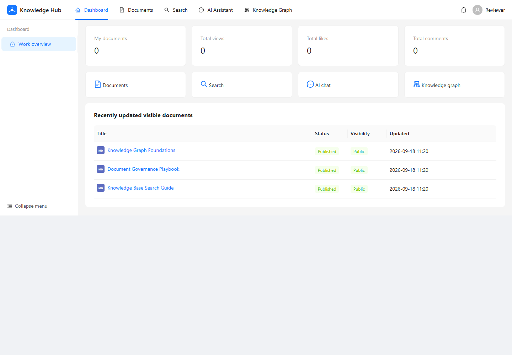
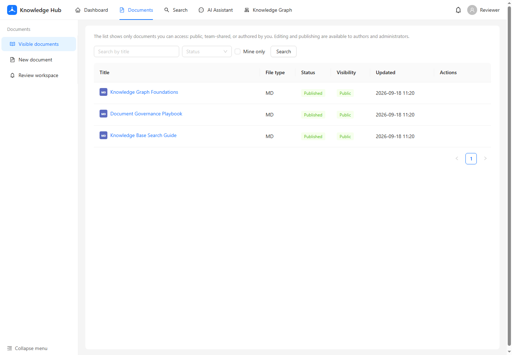
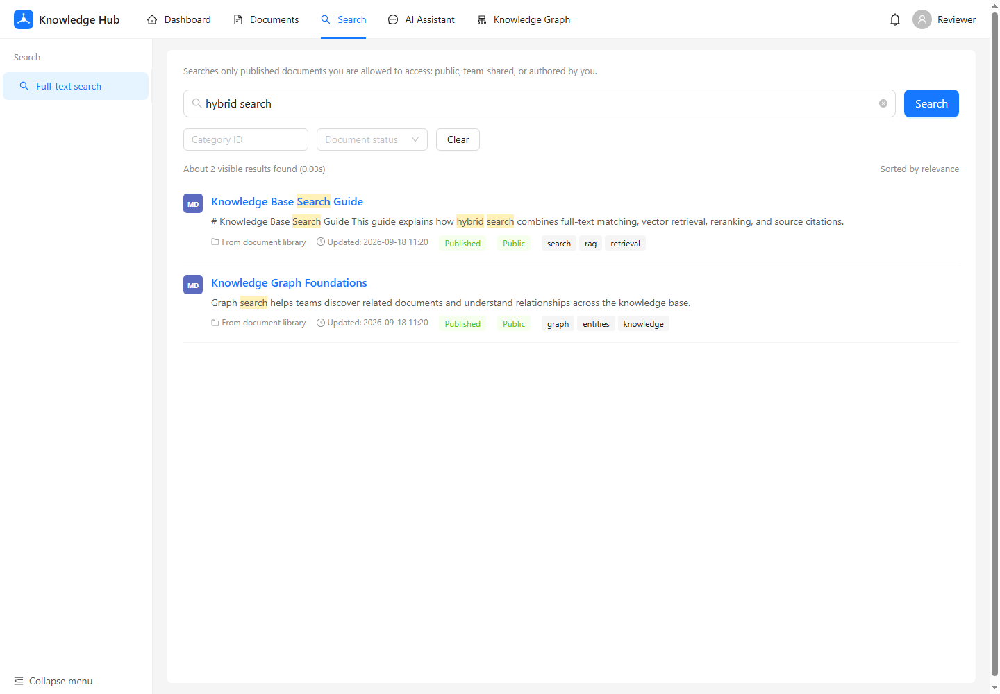
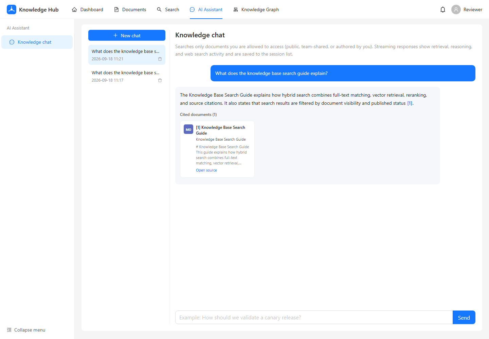
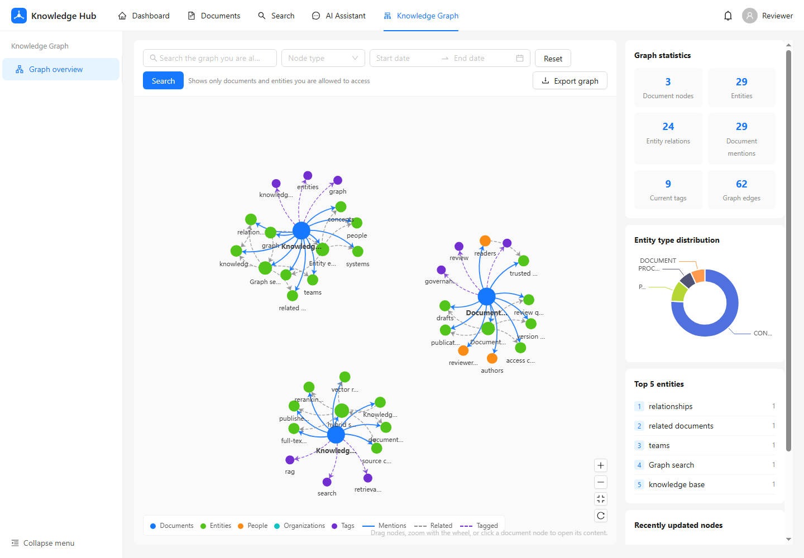
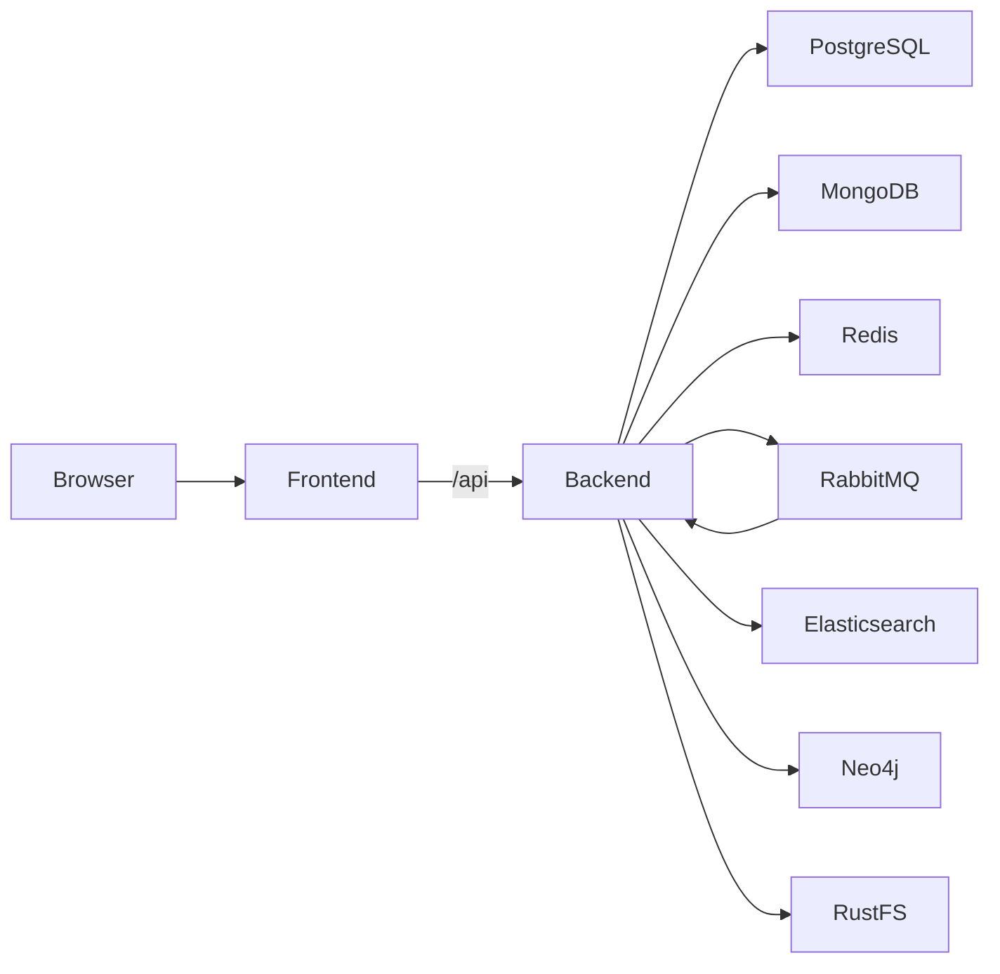

# Smart Knowledge

Smart Knowledge is an enterprise knowledge workspace for document governance,
hybrid retrieval, and retrieval-augmented generation (RAG). It combines a
React workspace with a NestJS API and a local, reproducible data platform.

The project is designed to demonstrate a complete workflow rather than a
single CRUD screen:

```text
upload -> parse -> review -> publish -> index -> retrieve -> answer with sources
```

## What It Demonstrates

| Area | Included workflow |
| --- | --- |
| Document governance | Drafts, review queues, publishing, archiving |
| Access control | Users, teams, roles, permissions, document visibility |
| Document processing | PDF, DOCX, XLSX, PPTX, TXT, and Markdown parsing |
| Search and RAG | Full-text search, vector retrieval, reranking, citations |
| AI workspace | Streaming answers, sessions, short- and long-term memory |
| Knowledge graph | Entity and relationship extraction with graph exploration |

## Demo Flow

Use the following path to explore the main workflow:

1. Sign in as `admin`.
2. Open Documents and upload a sample PDF or Markdown file.
3. Edit the draft and submit it for review.
4. Sign in as `reviewer`, approve the document, and show the published state.
5. Search for a document keyword and open the result.
6. Ask the AI workspace a question and show streaming source citations.
7. Open Graph to inspect extracted entities and relationships.
8. Finish in the admin pages to show users, roles, teams, and review queues.

## Screenshots

The screenshots below show the main workspace and retrieval flows:







## Architecture



The frontend is React/Vite and the API is NestJS. PostgreSQL stores relational
metadata, MongoDB stores parsed content, Redis stores cache and short memory,
RabbitMQ drives the asynchronous pipeline, Elasticsearch stores full-text and
vector indexes, Neo4j stores graph data, and RustFS provides S3-compatible
object storage. See [`docs/architecture.md`](docs/architecture.md) for details.

## Run The Demo

### One command with Docker Compose

Requirements:

- Docker Desktop or Docker Engine with Compose v2
- Node.js `22.22.0`
- pnpm `10.30.2` through Corepack

From the repository root:

```bash
corepack enable
pnpm install --frozen-lockfile
pnpm demo:start
```

On Windows, `pnpm demo:start` creates a local `.env` from `.env.example` when
needed, starts the Compose stack, and prints the service status. Open
`http://localhost:5173` after the frontend container is healthy.

On macOS or Linux, use `pnpm demo:start:unix` and
`pnpm demo:stop:unix`.

Stop the demo without deleting its data volumes:

```bash
pnpm demo:stop
```

The first PostgreSQL initialization seeds these local-only accounts:

| Username | Password | Role |
| --- | --- | --- |
| `admin` | `123456` | Administrator |
| `reviewer` | `123456` | Reviewer |
| `user` | `123456` | Standard user |

Change or remove these accounts before any deployment beyond local testing.
Database initialization scripts run only when their data volume is empty.

### AI and search providers

The basic application starts without paid provider credentials. To enable the
full AI flow, copy `.env.example` to `.env` and configure the providers you
intend to use:

- `OPENAI_API_KEY` or compatible `LLM_API_KEY` for chat and extraction
- `EMBEDDING_API_KEY` for embeddings
- `MEM0_API_KEY` for optional long-term memory
- `BOCHA_API_KEY` for optional web search

Keep production credentials in a secret manager. Never commit `.env`.

## Local Development

To run the infrastructure in Docker and the two applications from source:

```bash
docker compose up -d postgres mongodb redis rabbitmq elasticsearch neo4j rustfs
pnpm install --frozen-lockfile
Copy-Item .env.example backend/.env
pnpm dev
```

The frontend runs at `http://localhost:5173`, and Vite proxies `/api` to the
backend at `http://localhost:3000`. Run only one application with
`pnpm dev:backend` or `pnpm dev:frontend`.

## Verification

```bash
pnpm lint
pnpm typecheck
pnpm test
pnpm test:e2e
pnpm build
docker compose config
```

`pnpm test` runs backend unit tests and frontend utility tests.
`pnpm test:e2e` runs the backend HTTP smoke test without external services.
The complete interactive workflow requires a running Compose stack.

## Repository Layout

```text
backend/                   NestJS API and backend tests
frontend/                  React, Vite, and Nginx frontend
infra/                     Elasticsearch and database initialization assets
docs/                      Architecture and portfolio demo notes
scripts/                   Cross-platform local demo helpers
.github/                   CI and contribution templates
MERGE_PLAN.md              Monorepo merge and release validation plan
```

## Scope And Deployment Notes

The current repository is optimized for a reproducible self-hosted demo. The
full Compose stack is intentionally not reduced to a single serverless
function: the indexing and knowledge-graph workflows require persistent
databases, object storage, and a message consumer.

For a public portfolio, a polished README and screenshots are valid evidence
even when the full stack is not permanently hosted. Do not expose the
development database ports or seeded passwords to an untrusted network.

This project has not undergone a security audit. Review authentication,
authorization, default accounts, object-storage exposure, network binding, and
provider configuration before deployment.

See [`SECURITY.md`](SECURITY.md) for vulnerability reporting,
[`CONTRIBUTING.md`](CONTRIBUTING.md) for contributions, and
[`LICENSE`](LICENSE) for the MIT license.
