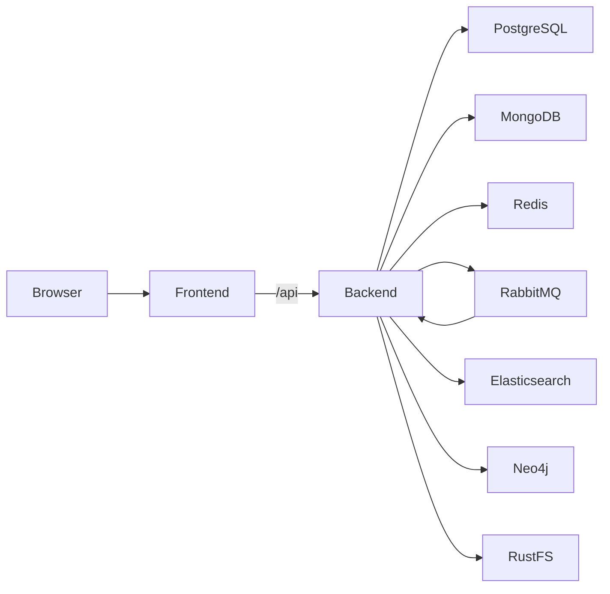

# Smart Knowledge

Smart Knowledge is a self-hosted knowledge management application for
organizing documents, discovering related information, and answering questions
with retrieval-augmented generation (RAG).

The monorepo contains a NestJS API and a React administration and knowledge
workspace. Its local stack uses PostgreSQL, MongoDB, Redis, RabbitMQ,
Elasticsearch, Neo4j, and RustFS.

## Features

- Upload and manage PDF, DOCX, XLSX, PPTX, TXT, and Markdown documents.
- Review and publish documents with user, team, and role-based permissions.
- Search full text and indexed document chunks.
- Ask questions with streaming responses and source citations.
- Explore entities and relationships in a knowledge graph.
- Manage users, roles, teams, and review queues.

## Architecture



See [docs/architecture.md](docs/architecture.md) for component details.

## Requirements

- Docker Desktop or Docker Engine with Compose v2
- Node.js `22.22.0`
- pnpm `10.30.2` (provided through Corepack)

The backend retains its Git history. The frontend is included as a snapshot of
upstream commit `f209569` from branch `v15`; its former repository history is
not part of this monorepo.

## Quick Start

```bash
corepack enable
pnpm install --frozen-lockfile
docker compose up -d --build
```

Open the application at `http://localhost:5173`. The API listens on
`http://localhost:3000`.

The Compose defaults are for an isolated local development environment. To
provide AI or search provider credentials, copy `.env.example` to `.env` and
edit the values. Never commit `.env` or expose the development services to an
untrusted network.

The first PostgreSQL initialization seeds local-only accounts:

| Username | Password | Role |
| --- | --- | --- |
| `admin` | `123456` | Administrator |
| `reviewer` | `123456` | Reviewer |
| `user` | `123456` | Standard user |

Change or remove these accounts before any deployment beyond local testing.
Database initialization scripts run only when their data volume is empty.

## Local Development

Start the infrastructure, create a backend environment file, and run the
frontend and backend from the workspace root:

```bash
docker compose up -d postgres mongodb redis rabbitmq elasticsearch neo4j rustfs
pnpm install --frozen-lockfile
cp .env.example backend/.env
pnpm dev
```

On PowerShell, use `Copy-Item .env.example backend/.env` in place of `cp`.
The frontend runs at `http://localhost:5173`; Vite proxies `/api` to the
backend at `http://localhost:3000`.

To run only one application, use `pnpm dev:backend` or `pnpm dev:frontend`.

## Environment

`.env.example` documents local database credentials, service endpoints,
authentication settings, mail configuration, and optional provider keys.
Required external provider keys depend on the enabled feature:

- `OPENAI_API_KEY` or a compatible `LLM_API_KEY` for chat and extraction
- `EMBEDDING_API_KEY` for embeddings (it may share an OpenAI-compatible key)
- `MEM0_API_KEY` for optional long-term memory
- `BOCHA_API_KEY` for optional web search

Keep production credentials in a secret manager. Rotate any credential that
has ever been committed to another repository.

## Quality Checks

```bash
pnpm lint
pnpm typecheck
pnpm test
pnpm test:e2e
pnpm build
docker compose config
```

`pnpm test` runs backend unit tests and frontend utility tests.
`pnpm test:e2e` runs the backend HTTP smoke test without external services.
The full interactive workflows still require a running Compose stack.

## Repository Layout

```text
backend/       NestJS API and backend tests
frontend/      React, Vite, and Nginx frontend
infra/         Elasticsearch image and database initialization scripts
docs/          Architecture and project documentation
.github/       CI and contribution templates
MERGE_PLAN.md  Monorepo merge and release validation plan
```

## Troubleshooting

- Check service health with `docker compose ps` and logs with
  `docker compose logs -f backend`.
- If a database volume predates a change to initialization scripts, the scripts
  will not run again automatically. Back up data before recreating local
  development volumes.
- AI responses, embeddings, reranking, and web search require valid provider
  settings. Core document and administration workflows can be tested without
  paid provider credentials.
- Change host ports in `docker-compose.yml` if they are already in use.

## Security and License

This project has not undergone a security audit. Review authentication,
authorization, default accounts, object-storage exposure, network binding, and
provider configuration before deployment.

See [SECURITY.md](SECURITY.md) for vulnerability reporting,
[CONTRIBUTING.md](CONTRIBUTING.md) for contributions, and [LICENSE](LICENSE)
for the MIT license.
