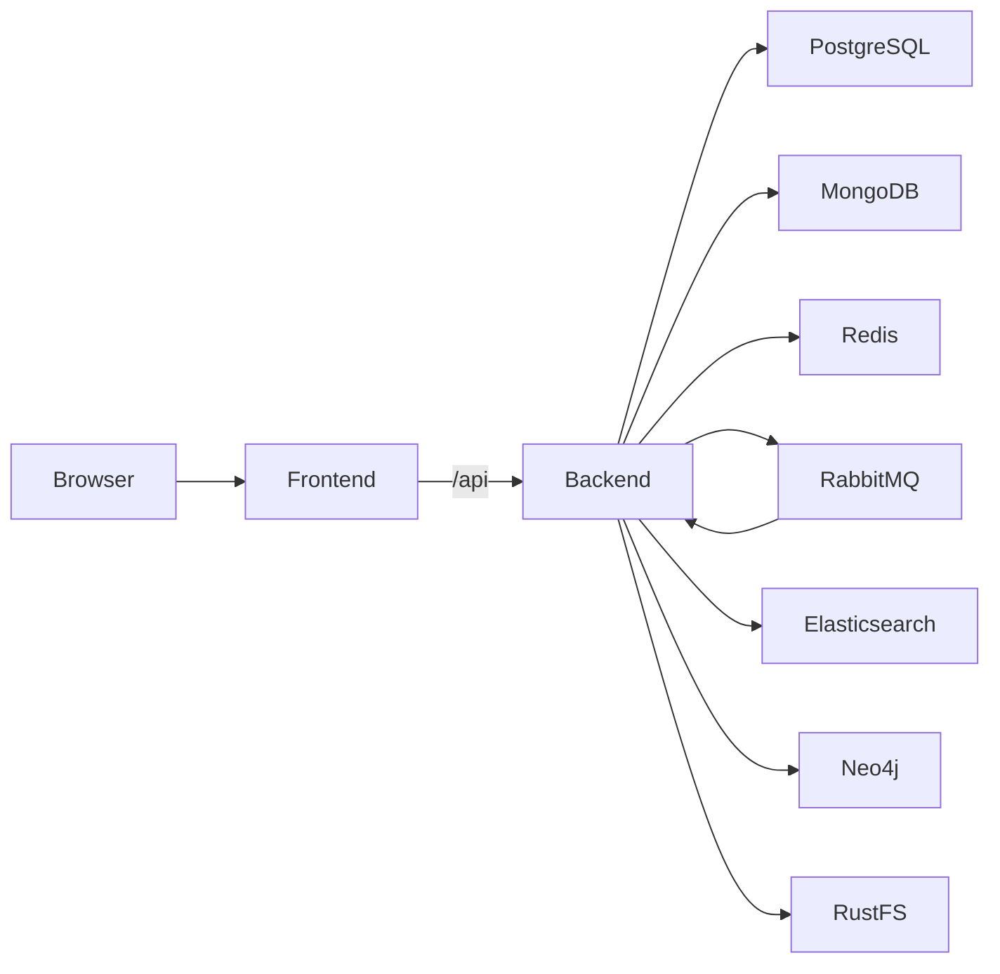

# Architecture

The React/Vite frontend is served by Nginx in the Compose stack. Nginx proxies
API and streaming requests to the NestJS backend. The backend stores relational
records in PostgreSQL, parsed content in MongoDB, cache/session data in Redis,
async work in RabbitMQ, search and vector indexes in Elasticsearch, graph data
in Neo4j, and uploaded objects in RustFS.

External AI, embedding, reranking, and web-search providers are configured by
environment variables. Provider credentials are optional for basic startup
and must never be committed to the repository.
